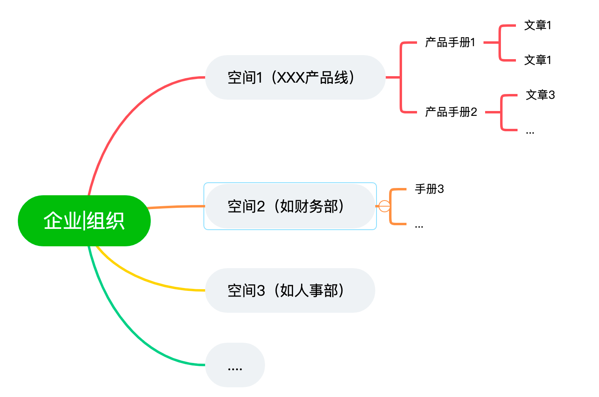
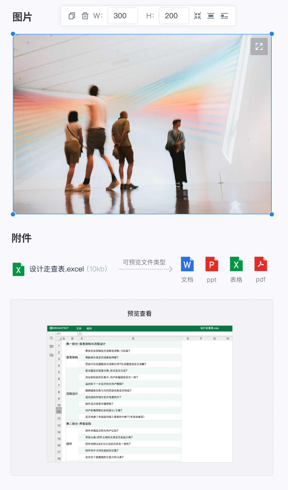
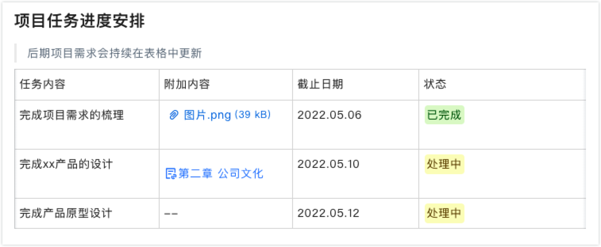

# 牵牛-电子帮助手册
[云端-电子手册（免费）](https://fx.beebox.cc/eman)

[本地私有化部署（免费）](https://hub.docker.com/r/beeboxcc/eman-app)

[帮助文档](https://fx.beebox.cc/eman/article/published?manualId=fbee664efc4ee44ed2632ca291904209)

电子手册是一款企业知识管理工具，通过独立的空间，结构化地组织在线协作文档，实现企业知识的积累和沉淀，促进知识的高度复用和流通。

### 结构管理合理，界面美观，易用
牵牛采用的空间-手册-文章三级来管理组织内容，空间是为一个企业或者组织设定的一个区域，每个空间相互独立，一个空间下可以有多个手册。每个手册下还可以按目录分类来管理文章，我们可以根据业务自行划分管理结构，全覆盖组织所有的手册需求， 结构示例如下图所示。

## 主要功能介绍
### 强大的编辑器
- 提供类[语雀](https://www.yuque.com/)编辑体验，且更专注手册内容创作。
- 支持插入图片、音频、视频、附件多种内容格式
- 支持office、pdf、视频、音频文档在线预览
- 支持嵌入表格，行列可随意增减，文字、图片、附件、状态均可进行添加使用
- 支持关联文件，方便文档之间进行串联，构建网状信息结构

 

### 方便快捷的文章阅读
- 左侧为手册目录导航，中间文章内容，右侧为文章大纲，可以快速定位文章内容。
- 内容支持全文检索，并高亮显示命中结果
- 手机端也可以方便查看

### 手册发布分享
手册支持两个分享场景：
- 内部分享-组织内部成员可访问。
- 外部分享-获取到链接的互联网用户可访问

### 空间成员管理及授权
每个空间都可以进行独立的权限管理，支持管理、编辑、查看人员的设置。

### 私有化布署
牵牛不仅仅有免费的云端版，还支持免费的私有化布署，并提供了容器一键安装模式，数据本地管理。

👉私有化部署参考这里

牵牛-电子手册主要应用场景。

